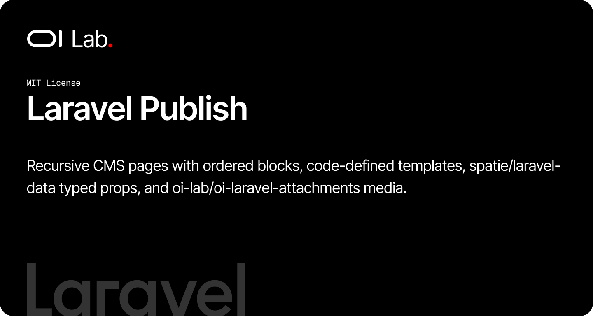

[](https://packagist.org/packages/oi-lab/oi-laravel-publish)
[](https://packagist.org/packages/oi-lab/oi-laravel-publish)
[](https://github.com/oi-lab/oi-laravel-publish/actions)
[](LICENSE)

# OI Laravel Publish

Recursive CMS pages with ordered blocks, code-defined templates,
`spatie/laravel-data` typed props, and `oi-lab/oi-laravel-attachments` media.

The package ships the **data layer only** — models, data, form requests,
migrations, config and a template registry. It does not ship controllers, routes
or views; your application wires the UI.

## Requirements

- PHP 8.2+
- Laravel 11, 12, or 13
- `oi-lab/oi-laravel-attachments` (media collections)
- `spatie/laravel-data`

## Installation

```bash
composer require oi-lab/oi-laravel-publish
```

Publish and run the migrations:

```bash
php artisan vendor:publish --tag=oi-laravel-publish-migrations
php artisan migrate
```

Optionally publish the configuration (to customise templates, models, renderers):

```bash
php artisan vendor:publish --tag=oi-laravel-publish-config
```

If your application exposes a key/value `Setting` model, seed the renderer
settings:

```bash
php artisan publish:install-settings
```

## Concepts

| Concept | What it is |
|--------|-------------|
| `PublishPage` | A recursive page (`parent_id` → `children`) owning ordered `blocks` and a `cover`. |
| `PublishBlock` | An ordered block belonging to one page, owning `cover` + `slides`. |
| `PublishTemplate` | A code-defined descriptor (key, type, default props, typed `propsClass`). Not a DB table. |
| `PublishTemplateRegistry` | The catalogue of templates, from config + runtime registration. |
| `PropsData` / `PropsCast` | Typed, spatie-data props for the JSON `props` column, ts-compatible. |

## Usage

```php
use OiLab\OiLaravelPublish\Models\PublishPage;
use OiLab\OiLaravelPublish\Models\PublishBlock;

$home = PublishPage::create([
    'template_key' => 'landing',
    'name'         => 'Home',
    'slug'         => 'home',
]);

$about = PublishPage::create([
    'parent_id'    => $home->id,
    'template_key' => 'default',
    'name'         => 'About',
    'slug'         => 'about',   // unique per parent
]);

$hero = PublishBlock::create([
    'publish_page_id' => $home->id,
    'template_key'    => 'hero',
    'name'            => 'Hero',
    'key'             => 'hero',
    'props'           => ['heading' => 'Welcome', 'alignment' => 'center'],
]);

$home->blocks;            // ordered by `sort`
$hero->props->heading;    // 'Welcome' (typed HeroData)
$hero->template();        // PublishTemplateData
```

### Attachments

```php
$home->attachFile($file, 'cover');
$hero->syncAttachments([$slideA, $slideB], 'slides');
```

### Resolving collaborators

Always go through the static resolver so config overrides apply:

```php
use OiLab\OiLaravelPublish\OiLaravelPublish;

OiLaravelPublish::pageModel();
OiLaravelPublish::template('hero');
OiLaravelPublish::blockTemplates();
```

## Customizing models & templates

Override the `models` and `templates` config entries, or register templates at
runtime from a service provider:

```php
use OiLab\OiLaravelPublish\Data\PublishTemplateData;
use OiLab\OiLaravelPublish\Enums\PublishTemplateType;
use OiLab\OiLaravelPublish\OiLaravelPublish;

OiLaravelPublish::registry()->register(new PublishTemplateData(
    key: 'pricing',
    name: 'Pricing table',
    type: PublishTemplateType::Block,
    propsClass: \App\Publish\PricingData::class,
));
```

## Testing

```bash
composer test
```

## AI Assistant Skills

This package ships an AI assistant skill. Install it into a host app with:

```bash
php artisan oi:install-ai-skill
```

## Testing

```bash
composer test
```

## License

The MIT License (MIT). Please see the [License File](LICENSE) for more information.

## Credits

**[Olivier Lacombe](https://www.olacombe.com)** - Creator and maintainer

Olivier is a Product & Technology Director based in Montpellier, France, with over 20 years of experience innovating in UX/UI and emerging technologies. He specializes in guiding enterprises toward cutting-edge digital solutions, combining user-centered design with continuous optimization and artificial intelligence integration.

**Projects & Resources:**
- [OI Dev Docs](https://dev.olacombe.com) - Documentation for all Open Source OI Lab packages
- [OnAI](https://onai.olacombe.com) - Training courses and masterclasses on generative AI for businesses
- [Promptr](https://promptr.olacombe.com) - Prompt engineering Management Platform

## Support

For support, please open an issue on the [GitHub repository](https://github.com/oi-lab/oi-laravel-attachments/issues).
